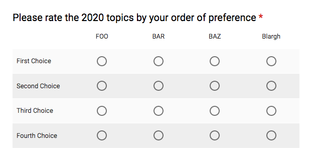
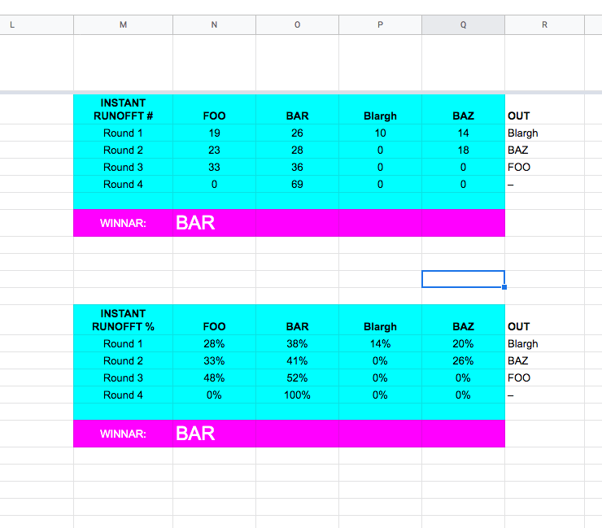

# googForm-Instant-Runoff
Instant Runoff Script for use in Goog Forms response sheets

1. Make a Google Form vote grid like above. 
1. Set it to require a response in each row, and
1. Limit to one response per column.
1. Get your peeps to rate their choices!
1. Once they do, open the responses spreadsheet and go to Tools > Script Editor.
1. Paste the contents of `instantRunoff.gs` into your local script, save and close the Script Editor.
1. Somewhere on the right side of the responses spreadsheet, paste into a cell:

     =instantRunoff(cellRange,inPercent)

`cellRange` is something like `$H$2:K`

`inPercent` is a bool; if `false` returns result in total vote count, otherwise percent. False by default.

...and presto! It will give you a breakdown of instant runoff results lookin something like this:

## Caveats

- It can process any number of choices
- It **doesn't** handle ties any kind of inteligent way. It just picks one that sorted unluckily. 
